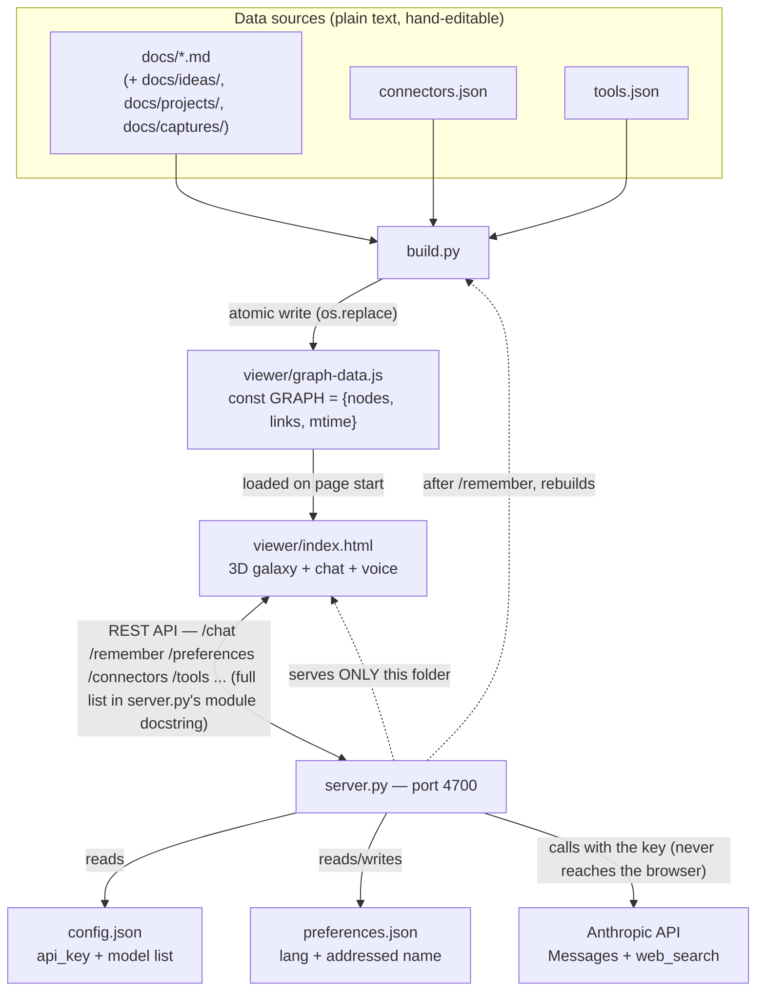
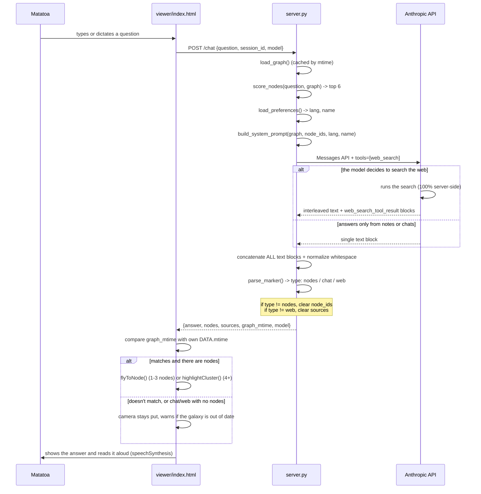
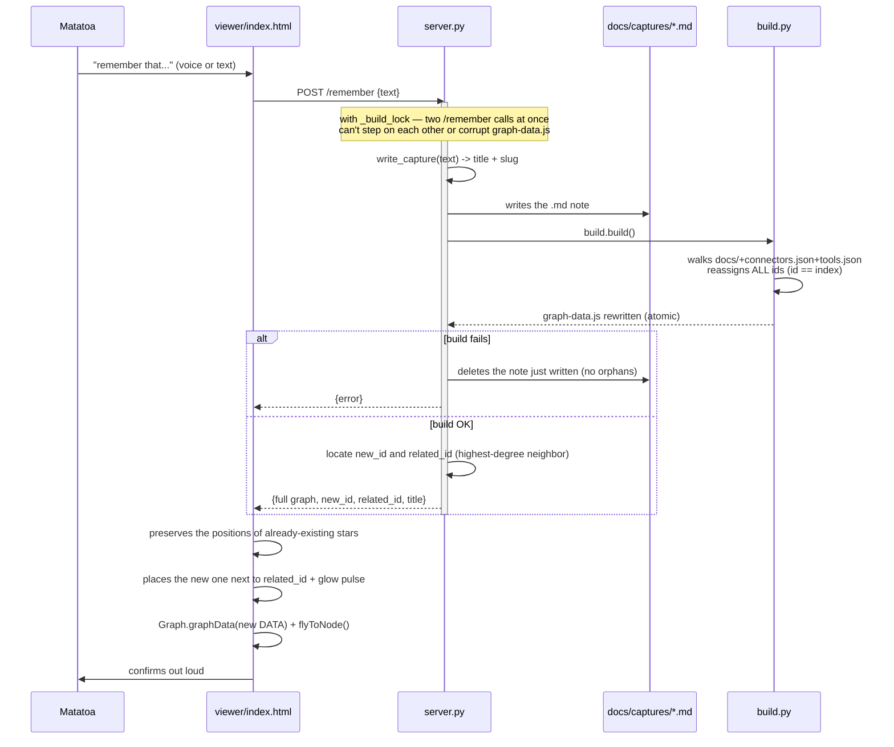

# MoAI — Technical Architecture

*Reference document written so that any session or model can continue the project without prior context. This file explains HOW what's already built actually works.*

---

## 1. Overview



Everything runs locally. The only thing that leaves the machine are `server.py`'s calls to the Anthropic API (with the question and the relevant nodes) — never the API key, never directly from the browser.

---

## 2. Responsibility of each file

| File | What it does |
|---|---|
| `build.py` | Walks `docs/` (skipping `docs/en/`, `docs/es/`), `connectors.json`, `tools.json`; generates `viewer/graph-data.js`. Standard library only. |
| `server.py` | HTTP server (`http.server`, standard library only). Serves `viewer/` and exposes a dozen-plus endpoints (`/chat`, `/remember`, `/preferences`, `/connectors`, `/tools`, `/runtime`, ... — full list in the module docstring at the top of the file). |
| `viewer/index.html` | The entire frontend in a single file: 3D galaxy (3d-force-graph via esm.sh), chat bar, voice (Web Speech API), node panel, powers panel. |
| `viewer/graph-data.js` | **Generated, do not edit by hand.** Overwritten on every `build.py` run or `/remember` call. |
| `config.json` | `api_key` + `models` (list of selectable models). Outside `viewer/`, in `.gitignore`. |
| `preferences.json` | `lang` (`es`/`en`) + addressed name, read by `build_system_prompt()`. Also `.gitignore` — per-installation state, not shared config. |
| `connectors.json` / `tools.json` | Each entry is a `connector`/`tool` type node. The `status` field (`active`/`placeholder`) decides whether it shows as "active" in the Council of Powers (Phase 7). |
| `docs/ideas/`, `docs/projects/`, `docs/captures/`, rest of `docs/` | Real content in Markdown. `docs/ideas/` → `idea` type; `docs/projects/` → `project` type; `docs/captures/` → notes born from `/remember`; everything else under `docs/` (except `docs/en/`, `docs/es/`) → `note` type. |
| `viewer/images/moai-clean.png` | Real photo of a Moai — base for Phase 9 (animated face). The only `images/` folder actually served — `server.py` serves `viewer/` only. |

---

## 3. `/chat` flow (with web search)



**Why the `[[nodes]]/[[chat]]/[[web]]` marker exists:** it's the only way the server knows whether it should move the camera. The system prompt forces the model to prepend it; `parse_marker()` looks for it anywhere in the response (not just the start, because a web search can prepend a sentence of intent before the marker) and, if it finds none but there are real sources, it infers `web` rather than blindly assuming `nodes`.

---

## 4. `/remember` flow



---

## 5. Critical rules and non-obvious decisions

- **`id == index` in `GRAPH.nodes`.** Explicit design decision since Phase 1: "future features depend on looking up nodes by index." Direct consequence: `build.py` **reassigns ALL ids on every run** (alphabetical order within each folder, made deterministic with `dirnames.sort()`), so a `/remember` call can shift the ids of notes that already existed, not just append one at the end. The `mtime` field in `GRAPH` (and `graph_mtime` in the `/chat` response) exist precisely so the viewer can detect when its copy went stale and avoid flying to the wrong star. It now self-heals instead of asking for a reload — see "Live graph refresh" in §9.
- **`py -3`, not `python`.** On Matatoa's machine, plain `python` points to the Microsoft Store alias.
- **esm.sh, not unpkg.** The `.mjs` bundle from unpkg for `3d-force-graph` doesn't bundle its dependencies (`three`); esm.sh does resolve them via `?deps=`. The `three` version imported in the module and the one in `?deps=` must match exactly, or the graph and sprites won't share the same instance.
- **Locks in `server.py`.** It's a `ThreadingHTTPServer`: it handles requests in parallel. `_build_lock` serializes note writes + graph rebuilds. `_session_locks` (one per `session_id`) serializes the history of a single conversation, so that two near-simultaneous questions don't break the `user`/`assistant` alternation required by the Messages API.
- **Atomic write.** `build.py` writes to a `.tmp` file and does `os.replace()` at the end — nobody ever reads a half-written `graph-data.js`.
- **The API key never reaches the browser.** It lives only in `config.json` (root, outside `viewer/`, in `.gitignore`). The server serves EXCLUSIVELY the `viewer/` folder — requesting `/config.json` from the browser gets a 404.
- **Graceful degradation on corrupt/unreadable files.** `load_json_list()` (server.py), `collect_json_nodes()` (build.py, `connectors.json`/`tools.json`), and `collect_md_nodes()` (build.py, individual `.md` notes) all skip the offending file with a `log_warning` instead of raising — a single bad-encoding note or malformed JSON file must not take the whole galaxy down. This matters especially in `build.py`, because `/remember` calls `build.build()` and, if it failed outright, the note just written would be deleted as a rollback.
- **Every response goes through `_guard(route)`.** `_RequestError` carries its own status, an upstream API failure (Anthropic/ElevenLabs) is a 502, a failed galaxy rebuild is a 500, a domain `RuntimeError` ("no note matches...") is a 409, and anything unexpected is a logged, generic 500 — nothing is ever answered with 200 for a request that didn't succeed.
- **Origin/DNS-rebinding guard.** `_enforce_origin()` runs first in every `do_*` (including `do_HEAD` and static-file GETs, not just the JSON routes): the `Host` header must be one of `ALLOWED_HOSTS`, and any `Origin`/`Sec-Fetch-Site` a browser sends must be same-origin. Header-less clients (curl, tests) pass — only a browser attaches those headers, and a browser that does must prove same-origin. This is what stops an attacker page (or a domain of its own resolving to `127.0.0.1`) from forging note writes, deletions, or API-key-spending `/chat`/`/tts` calls.
- **Dev mode can't be armed remotely.** `dev_mode_allowed()` gates both `set_runtime_mode("dev")` and `/dev/execute` on the server having been started with `MOAI_DEV=1` or `--dev` — an HTTP request alone can never turn Dev mode on, since `/dev/execute` reads and writes local files.
- **One-slot undo for note deletion.** `_last_deleted` (module-level, `{path, content}`) is filled by `_stash_and_remove()`, which every deletion entry point uses instead of a bare `os.remove()` — the `delete_note` chat tool, the Dev console's `notes.delete`, and the plain `DELETE /note` endpoint all share it. `undo_last_delete()` (chat tool `undo_delete`, voice-triggerable: "undo that" / "deshaz eso") restores it. Only the single most recent deletion is recoverable — a second delete before the first is undone overwrites the slot and the first is gone for good. This is a safety net for a misheard voice command, not a trash can.

---

## 6. Accepted, not fixed

Things found during audits and left as-is on purpose — don't rediscover them as if they were new:

- **Id drift across tabs.** If you have two tabs open and one does `/remember`, the other is left with potentially shifted ids until it self-heals (its next `/chat` call detects the mismatch and refetches — see "Live graph refresh" in §9) or until `↻ Refresh`/a reload is used manually; an idle tab with no interaction won't refresh on its own. `graph_mtime` is what makes this detectable at all, preventing a stale id from moving the camera to the wrong star in the meantime. Fixing the drift itself at the root would mean abandoning the "id == index" rule — an explicit design decision, not an oversight.
- ~~`_sessions` grows without bound~~ **Fixed**: capped at `MAX_SESSIONS` (200) — a new session past the cap evicts whichever existing session was least recently accessed (`_session_times`), not insertion order.
- ~~`_read_body` doesn't cap `Content-Length` size~~ **Fixed**: `_read_body(max_bytes=...)` rejects an oversized body with 413 before reading it (per-route caps: `MAX_BODY_CHAT`, `MAX_BODY_REMEMBER`, `MAX_BODY_EDIT`, `MAX_BODY_ENTITY`, `MAX_BODY_TTS`, `MAX_BODY_DEV`).

---

## 7. How to run the project

```bash
py -3 build.py       # generates/updates viewer/graph-data.js
py -3 server.py       # starts at http://localhost:4700
```

Open Chrome at `http://localhost:4700`. Paste the API key into `config.json` (never in the chat).

---

## 8. File structure

```
moai/
├── README.md                   # quick start
├── config.json                 # api_key + models — NEVER in git (.gitignore)
├── config.example.json         # safe template — copy to config.json
├── preferences.json            # lang + addressed name — NEVER in git (.gitignore)
├── preferences.example.json    # safe template
├── connectors.json             # "connector" type nodes
├── tools.json                  # "tool" type nodes
├── build.py                    # indexer: docs/+JSON -> graph-data.js
├── server.py                   # server — see its module docstring for every endpoint
├── docs/
│   ├── ideas/*.md               # -> "idea" type nodes
│   ├── projects/*.md            # -> "project" type nodes
│   ├── captures/*.md            # notes born by voice (/remember)
│   ├── en/ARCHITECTURE.md       # this document (skipped by build.py)
│   └── es/                      # Spanish project docs (also skipped by build.py)
├── viewer/
│   ├── index.html               # the entire frontend
│   ├── graph-data.js            # generated — DO NOT edit by hand
│   └── images/                  # the only images/ folder actually served
└── tests/                       # offline unit tests, no network/API calls
    ├── galaxy.py                 # shared TempGalaxy fixture (not a test file itself)
    ├── test_build.py
    ├── test_server.py
    ├── test_server_api.py        # model resolution, Anthropic request/tool-use loop, ElevenLabs proxy
    ├── test_server_helpers.py    # path guards, config loading, note writing, graph cache, Dev whitelist
    └── test_server_http.py       # every HTTP endpoint against a real ThreadingHTTPServer
```

---

## 9. Frontend implementation reference (`viewer/index.html`)

The entire UI is a single HTML file (CSS + HTML + JS, no build step, no
framework). This section is the detailed reference; the project's own
fast-path context doc keeps only a short index pointing here.

### CSS variables (theme)
```css
--space: #060b0e        /* background */
--note: #8fae6f         /* green */
--connector: #45c4b0    /* teal */
--tool: #c98a5e         /* orange */
--project: #d9aa4b      /* gold */
--idea: #f2e8d5         /* cream */
--face-standby: #e8ede9
--face-thinking: #e8c22e
--face-talking: #4fa3e0
--face-tools: #4caf6e
--face-error: #e0554a
```

### Moai face

`#moai-face` is a `180×270px` container (bottom-right) with:
- `` — `moai-clean.png` with `object-fit: cover; object-position: top center`
- `<svg id="moai-svg" viewBox="0 0 72 108">` — SVG overlay drawn on top
  - Eyes (`eye-l`, `eye-r` rects), pupils (`eye-pupil` circles), nose mark, mouth line
  - Chest ring + inner fill circle + glyph accent lines
  - `face-outline` rect (thin perimeter border around the face)
- **5 CSS states** driven by `setFaceState(state)`:
  - `s-idle` — opacity 0.1 (nearly invisible in standby)
  - `s-listening` — dim white
  - `s-thinking` — gold animated pulse
  - `s-tools` — green animated pulse
  - `s-talking` — blue animated pulse (same animation as thinking)
  - `s-error` — red

`setFaceState` is called from: `setStatus()` (thinking/tools), `rec.onstart` (listening), `speakBrowser` / `speakElevenLabs` start/end events (talking).

### Splash screen

`#splash` covers the full viewport with `images/web.jpg`.
- First visit: 5 seconds minimum delay.
- Subsequent visits: 300ms.
- Click-to-skip: `splashEl.addEventListener('click', e => { if (e.button === 0) hideSplashNow(); }, { once: true })`.
- `hideSplashNow()` directly adds `.hide` class (opacity → 0) then removes the element after 1.2s.
- **Do NOT use `maybeHideSplash()` for click-to-skip** — it requires both `splashMinDelayDone` AND `splashAppReady` flags to be true, so clicking before the galaxy engine finishes would do nothing.

### Conversation mode

Button `#conv-mode` toggles `conversationMode` flag (persisted in `localStorage`).
When ON: after `speak()` resolves, `startListening()` is called automatically.
`speak()` returns a `Promise` — both `speakBrowser()` and `speakElevenLabs()` are async and resolve when audio finishes.

### Bilingual preferences

Language (`es`/`en`) and the addressed name are stored server-side in `preferences.json` (GET/POST `/preferences`), not `localStorage` — every other setting on this page uses `localStorage`, this one deliberately doesn't, so it survives across browsers/reinstalls and is human-editable outside the browser, matching `config.json`'s pattern. On first run (`lang` is `null`), the viewer shows a one-time prompt (`#lang-prompt`) after the splash hides asking for a name and Español/English; after that it's changeable anytime via the `#lang-pick` toggle in the chat bar (voice + recognition switch live, no reload) or the name field in the Actions panel. `build_system_prompt()` in `server.py` reads `preferences.json` itself (not a client-supplied value) and selects between `_system_prompt_parts_es`/`_system_prompt_parts_en`. The "IORANA" greeting stays fixed in both languages — Rapa Nui brand identity, not an interface-language string — only the addressed name changes.

**Load-order gotcha (real incident):** `PREFS` must be declared before any code that reads it can run — `pickVoice()` reads `PREFS.lang` and is called synchronously at page load (`speechSynthesis.onvoiceschanged` + an immediate call), well before the rest of the Phase 16 block would otherwise declare it. Declaring `PREFS` there put it in the temporal dead zone, threw a `ReferenceError` on every load, and silently killed the entire script — the splash never hid and nothing after it ran, with no visible console error until deep inspection. Fixed by declaring `let PREFS` immediately after `let DATA = GRAPH;`, near the top of the script. If you add new state that early-running functions depend on, declare it that early too.

### Voice (speech recognition)

`SpeechRecognition` with `rec.lang` set to `es-ES` or `en-US` from the language preference. Single-shot (not continuous). In conversation mode, `rec.onend` restarts it after a 400ms delay.

### Voice (speech synthesis)

Auto-selects a voice matching the language preference — for Spanish it scores named voices (prefers "Álvaro", "Natural", "Pablo"); for English it just prefers a "natural/online" voice, since named voices aren't standardized enough across OSes to hardcode a short list. Manual override via `#voice-pick` dropdown. Voice preference saved to `localStorage` as `moai-voice-name` (this one setting stays client-side, unlike `lang`/`name`).

### ElevenLabs TTS — CURRENTLY DISABLED

`config-el.json` was deleted (user has free plan, free plan cannot call the TTS API). `POST /tts` returns `{"error": "ElevenLabs not configured"}`. The circuit breaker in `speakElevenLabs()` sets `elevenLabsDisabledUntil` for 5 minutes on any failure, so it doesn't retry on every answer.

**To re-enable:** create `config-el.json` from `config-el.example.json` with a real key and voice id (requires a paid ElevenLabs plan).

### Legend type filter

`#legend` in bottom-left corner, one item per type present in `DATA.nodes`, rebuilt by `refreshLegend()` on every graph swap. **Multi-select**: `activeTypeFilters` is a `Set`, not a single value — `toggleTypeFilter(type)` adds/removes `type` from it, so several types can be active at once (an empty set means "show everything"). `applyHighlight()` reads the set to decide per-node opacity/scale (`×1.35` for a match when filtering) and per-link opacity (touching a filtered type highlights the link), and zooms to fit whatever's currently selected (`Graph.zoomToFit(900, 700, node => activeTypeFilters.has(node.type))`, or the whole galaxy when the set is empty).

Each legend `<div>` is keyboard-accessible: `tabindex="0"`, `role="button"`, `aria-pressed` reflecting membership in `activeTypeFilters`, `aria-label`, a `:focus-visible` outline, and a `keydown` handler treating Enter/Space the same as a click. This was a real gap (plain clickable `<div>`s are invisible to keyboard/screen-reader users) — the same fix was later applied to the Navigator's Log's clickable stars (`.log-star`) and the powers panel's action items (`.power-item.clickable`); if you add another custom clickable element, follow the same pattern rather than reaching for a native `<button>` only sometimes.

### Chat bar

- `<textarea id="question">` (auto-grow via `autoGrowQuestion()` on `input` event, max-height 120px).
- `Enter` submits; `Shift+Enter` inserts newline.
- Successful answers go to the **Log panel** (right side panel), NOT the floating answer box.
- Floating `#answer-box` is reserved for errors only — a stale galaxy self-heals silently instead of showing a warning there (see "Live graph refresh" below).
- Log auto-opens on the first message (`logAutoOpened` flag, one-time only).
- `#new-chat-toggle` (header, next to Log/Refresh) resets `sessionId` (a new `crypto.randomUUID()`, persisted to `sessionStorage`) so the next `/chat` call carries no prior turns as context. It does **not** touch the Navigator's Log — that's a separate, deliberately durable transcript, not API conversation state. Purely client-side; no server endpoint involved.

### Navigator's Log

`localStorage` key `moai-log`, max 300 entries. Each entry: `{ts, type, question, answer, nodes, sources}`. Stars in the log (`.log-star`) are clickable — and keyboard-accessible (Tab + Enter/Space, see "Legend type filter" above for why) — to fly to the node. Sources are filtered for `https?://` before rendering.

### 3D galaxy

`3d-force-graph` loaded from `esm.sh`. Key imports:
```js
import ForceGraph3D from 'https://esm.sh/3d-force-graph@1.77.0?deps=three@0.180.0'
import * as THREE   from 'https://esm.sh/three@0.180.0'
import { UnrealBloomPass } from 'https://esm.sh/three@0.180.0/examples/jsm/postprocessing/UnrealBloomPass.js?deps=three@0.180.0'
```

> **esm.sh, not unpkg.** unpkg's `.mjs` bundle doesn't include dependencies; esm.sh resolves them via `?deps=`. The `three` version in the import and in `?deps=` must match exactly, or nodes and sprites won't share the same Three.js instance.

Bloom: `UnrealBloomPass(resolution, strength=0.9, radius=0.4, threshold=0.12)` added via `Graph.postProcessingComposer().addPass(bloomPass)`.

### Slash commands

Handled client-side in `handleSlashCommand()`:

| Command | Action |
|---|---|
| `/remember <text>` | Opens save flow, calls `POST /remember` |
| `/edit-note <title>` / `/remember-edit <title>` | Opens edit flow (both are aliases for the same handler) |
| `/delete-note <title>` | Opens delete flow, calls `DELETE /note` |
| `/list-notes [q]` | Lists notes (optional search) |
| `/list-connectors` | Lists connectors |
| `/list-tools` | Lists tools |
| `/web-search <query>` | Not handled by `handleSlashCommand()` itself — falls through as a normal question, and the system prompt instructs the model to always use the web_search tool when a message starts with this prefix |

Command menu (`#slash-menu`) appears when the user types `/` in the textarea.

### Live graph refresh

`refreshGraphData(newGraph)` is the single shared function every "the server
sent back a fresh graph" path goes through: it preserves each existing
node's `(x, y, z)` position (matched by `nodeKey(n)`, i.e. `n.path`, or a
`'#' + label` fallback for connector/tool nodes — which have no `path` and
would otherwise all collide on the same `undefined` key) so the galaxy
doesn't visibly jump or reset, then swaps `DATA`, recomputes `neighbors`,
clears focus/highlight state, calls `Graph.graphData(DATA)`, and
`refreshLegend()`. `liveAddNode(data)` (used by `/remember` and by the
`save_note` chat tool) calls it first, then does the extra "new star is
born next to its most related node" positioning and the birth-pulse camera
flight — those two are the only callers that have a specific new node to
animate.

**Real incident:** `askMoai()`'s `/chat` response handler used to gate the
refresh on `if (data.new_id != null && data.graph)`. `new_id` is only ever
set by the `save_note` tool (`server.py`'s `_handle_chat` — see §3) — so
when the model called `delete_note`, `manage_connector`, or `manage_tool`
instead, the server correctly sent back `data.graph` (detected via mtime,
same §3), but the client silently ignored it. The galaxy looked stale
after any delete or connector/tool edit done through chat, with no error
anywhere — indistinguishable from a real bug in the mutation itself unless
you knew to check the client-side gate. Fixed: refresh whenever `data.graph`
is present; only additionally call `liveAddNode`'s new-node logic when
`data.new_id != null`. **If you add another mutating tool, make sure its
server-side handler still funnels through the same mtime-based `data.graph`
detection in `_handle_chat`, and don't reintroduce a `new_id`-only gate on
the client.**

`#refresh-toggle` (header) is the manual fallback: `GET /graph` (thin
wrapper around `load_graph()`, mtime-cached) followed by
`refreshGraphData()`. It exists because no auto-refresh path can cover
every case — edits made outside the app (a text editor, `build.py` run by
hand), another open tab's changes, or the Dev console's local operations
(`/dev/execute`) none of which push anything to already-open viewer tabs.
